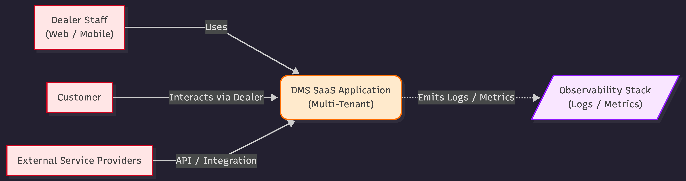
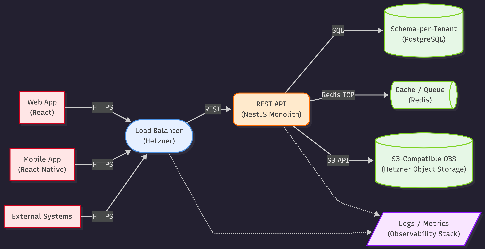

# DMS SaaS Architecture Overview

## Context

This document presents a reconstructed high-level architecture of a Car Dealer Management System (DMS) SaaS transformation project.\
It is recreated for portfolio purposes to demonstrate architectural reasoning, trade-offs, and system design maturity.\
The reconstruction focuses on architectural intent rather than implementation detail.

------------------------------------------------------------------------

## 💡 Purpose

Transform a single-client, ad hoc DMS implementation into a scalable multi-tenant SaaS platform for automotive dealerships.

The platform enables:

- Vehicle sales & purchases
- Financing workflows
- Contract generation & eSignatures
- Accounting & invoicing
- Dealer operations management
- Third-party integrations

Core objective: standardize dealership workflows while enabling automation, compliance, and controlled scalability.

------------------------------------------------------------------------

## ⚠️ Problem Context

The legacy system exhibited severe structural and operational weaknesses:

### Data & Consistency Issues

- No enforced referential integrity.
- Inconsistent domain invariants.
- Backend-level hardcoded data bypassing persistence rules.
- Improper transaction boundaries — partial failures left the database in inconsistent state.
- Lack of rollback strategy across multi-step operations.

### Engineering & Delivery Gaps

- No CI/CD pipeline.
- Manual deployments using pm2.
- No automated testing or acceptance criteria enforcement.
- No structured monitoring or error reporting.

### Infrastructure Prematurity

- Later initiative to prepare for Hetzner cloud deployment (Load Balancer, FE/BE replicas, PostgreSQL read replica).
- However, this was introduced before multi-tenant scale or measurable load justified distributed complexity.

The system required stabilization before any scalability investment.

------------------------------------------------------------------------

## 🎯 Goals

- Stabilize engineering processes (QA, CI/CD, error monitoring)
- Define clear bounded contexts and domain ownership
- Introduce multi-tenant architecture
- Implement containerized deployments (Docker/Kubernetes)
- Introduce structured observability
- Enforce tenant data isolation and GDPR compliance
- Clarify functional vs non-functional documentation
- Enforce transactional integrity and domain invariants.
- Eliminate hardcoded data from backend services.
- Introduce migration-safe schema evolution.
- Establish CI/CD and reproducible deployments.
- Sequence infrastructure maturity based on actual tenant growth.

------------------------------------------------------------------------

## 🚫 Non-Goals

- No full domain rewrite in Phase 1
- No premature microservice decomposition
- No deep tenant-level customization beyond configuration
- No cross-tenant data aggregation in initial release

------------------------------------------------------------------------

## 🧠 Assumptions

- Brownfield refactor scenario
- Multi-tenant SaaS target state
- Regulated financial workflows
- Fixed budget and phased modernization
- Moderate initial tenant scale with growth expectation

------------------------------------------------------------------------

## 🔒 Quality Attributes

### Scalability

- Horizontal scaling at application layer
- Tenant-aware request routing
- Isolated scaling of integration workloads

### Reliability

- Idempotent integration flows
- Retry policies with backoff
- Explicit transaction boundaries

### Performance

- Redis caching for high-read aggregates
- Asynchronous processing for external integrations

### Availability

- Multi-environment deployment (Dev / Staging / Prod)
- Container orchestration with Kubernetes

### Consistency

- Strong ACID guarantees within transactional boundaries (PostgreSQL)
- Explicit transaction scope definition at use-case level
- Referential integrity enforcement
- Atomic operations across financial workflows
- Eventual consistency across external integrations

### Security

- Tenant data isolation (schema-per-tenant or logical partitioning)
- JWT-based authentication
- Audit logging for financial operations
- GDPR-aligned data handling

### Operability

- Centralized logging
- Metrics & alerting
- Error monitoring integration
- CI/CD pipeline introduction
- Containerized deployments
- Infrastructure-as-Code readiness
- Controlled promotion across environments

------------------------------------------------------------------------

## 🧱 High-Level Design

Layered SaaS architecture with explicit separation of responsibility zones:

- Clients interact via API layer
- API layer orchestrates use cases
- Domain services encapsulate business rules
- Persistence enforces tenant isolation
- Integration layer isolates external dependencies
- Observability operates non-invasively

Evolution path: Modular Monolith → Selective Service Decomposition → Distributed Services (if justified by scale)

------------------------------------------------------------------------

## 🧩 Core Components

### 🟠 API Layer

-   REST API (tenant-aware routing)
-   Use-case orchestration
-   Request validation
-   DTO mapping
-   API versioning

### 🟡 Domain Services

Bounded contexts:

-   Sales & Purchase
-   Financing
-   Contracts & Document Management
-   Accounting & Invoicing
-   Dealer Operations

Each context:
- Owns its data
- Defines transaction boundaries
- Emits domain events

### 🟢 Persistence Layer

-   PostgreSQL (multi-tenant model)
-   Redis (cache & async support)
-   Object storage for documents

### 🔵 Infrastructure & Integration

- API Gateway / Ingress (NGINX-based)
- Docker containerization
- Kubernetes orchestration (target state)
- CI/CD pipelines (introduced during stabilization phase)

Legacy state:
- Manual pm2-based deployments

Planned conditional scaling (Hetzner Cloud):
- Load Balancer
- 1 FE replica
- 1 BE replica
- PostgreSQL read replica (reporting workloads)

### 🔷 Security & Resilience

-   OAuth2 / JWT authentication
-   Role-based access control
-   Rate limiting & WAF
-   Secrets management
-   Financial audit trail

### 🟣 Observability & Cross-Cutting

-   Structured logging
-   Centralized log aggregation
-   Metrics & alerting
-   Business telemetry
-   Tenant-scoped audit logs

------------------------------------------------------------------------

## ⚖️ Major Trade-offs

### Multi-Tenant Data Model

- Schema-per-tenant improves isolation and compliance
- Increases operational complexity and migration overhead

### Refactor vs Rebuild

- Refactor reduces budget risk and preserves continuity
- Retains some legacy technical debt

### Microservices vs Modular Monolith

- Modular monolith reduces infrastructure overhead early
- Allows controlled evolution toward distributed services

------------------------------------------------------------------------

## ⚠️ Key Risks

- Migration risk during SaaS transition
- Integration instability from external providers
- Operational overhead of schema-per-tenant model
- Eventual consistency reconciliation complexity
- Underestimated observability requirements

------------------------------------------------------------------------

## 🚀 Evolution Roadmap

**Phase 1 --- Stabilization**: Introduce QA, CI/CD, monitoring - Define domain boundaries

**Phase 2 --- SaaS Enablement**: Implement tenant isolation - Harden authentication & authorization

**Phase 3 --- Integration Hardening**: Introduce adapter standardization - Implement retry & circuit breaker policies

**Phase 4 --- Observability Maturity**: Business-level telemetry - Proactive alerting & SLO definition

------------------------------------------------------------------------

## 🔀 Example Flow --- Vehicle Sale

1.  Dealer creates Sales Offer via Web App
2.  API validates tenant and routes request
3.  Sales Domain persists offer within tenant boundary
4.  Financing Domain submits loan application asynchronously
5.  Upon approval, Contract Domain generates agreement
6.  Document Domain issues eSignature request
7.  Signed document stored in tenant storage
8.  Accounting Domain generates invoice & ledger entry
9.  Domain events trigger notifications
10. Logs & metrics emitted to observability stack

------------------------------------------------------------------------

## 📊 Architecture Modeling

The architecture is documented using the C4 model:

- Level 1 — System Context
- Level 2 — Container Diagram
- Level 3 — Component Diagram

This ensures clear separation of abstraction levels and consistent modeling discipline.

### ⚙️ Level 1 — System Context

### ⚙️ Level 2 — Container Diagram

### ⚙️ C4 Level 3 — Component Diagram (REST API)

------------------------------------------------------------------------

## Architectural Reflection
- Early infrastructure scaling (replicas, LB) was likely premature given tenant count.
- Strict ACID enforcement was prioritized due to financial domain invariants.
- The system adopts a schema-per-tenant strategy to enforce structural tenant isolation at the database level, minimizing cross-tenant data leakage risk in a financial domain.
- Gateway abstraction was intentionally simplified to avoid premature complexity.
